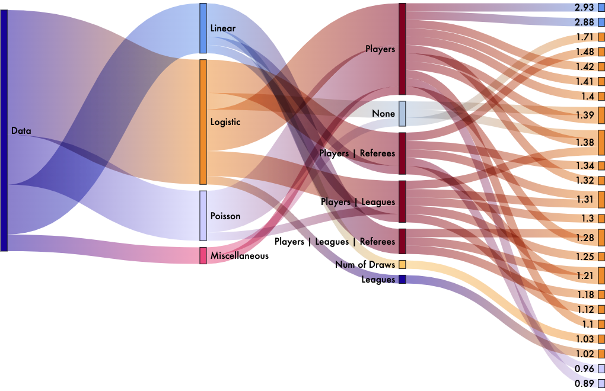

# Visualizing Uncertainty in Analytical Research

   

### 1. Uncertainty Type and Data Selection

The psychological science community is undergoing a replication crisis where according to an experiment performed by Open Science Collaboration (OSC) in 2015, only 47 out of 100 published studies could be successfully replicated. While OSC’s replication methodology is debated, it is acknowledged that uncertainty is inevitable in analytical research, and can result from varying analytical methods of similar professional reliability and validity. Therefore, researchers are recommended to keep an open mind to the limitations of classical statistics and embrace crowd-sourcing and collaborations that could contribute to balancing discussions and validating findings.

#### Uncertainty Project

The project is based on a crowd-sourced research experiment conducted by Silberzahn & Uhlmann in 2015, during which 29 teams of data experts were tasked to analyze the same set of data about occer players and attempt to answer the same question using an odd ratio metric – are darker skin-toned players more likely to receive red cards from referees?

29 teams produced 20 odd ratios ranging from 0.89 (more unlikely) to 1 (unlikely) and to 2.9 (more likely).

#### Illustration of experiment process

   

### 2. Visualization: 3D Plinko Machine Simulation

**Concept:** Use animation and 3D to draw analogies between abstract concepts and naturally occurring phenomena and test comprehension of the following ideas.

- The uncertainty in the analytical result is manufactured randomness.
- Despite the uncertainty, crowd-sourced research can be used to validate findings.
- This visualization can facilitate intuitive comprehension and new knowledge production.

**Goals:**

The primary purpose is to be experimental and expand Bertin’s print-based graphical system. Similar to the Galton board widely used to illustrate the Normal Distribution process, the visualization is intended to create natural knowledge mapping between a pinball’s trajectory falling off a Plinko machine and the seemingly random yet deterministic path of an analytical method. The visualization should be furnished with thoughtful signifiers and interaction design to enhance its overall affordance and user’s intuitive comprehension (Norman, 1988).

**Loftier Goals:**

By exploring natural phenomenon simulation, animation, 3D, and interaction, the author also wants to experiment with an interface design that facilitates multi-dimensional discovery and knowledge production (Drucker, 2014).

- Comprehension: Intuitive comprehension of core concepts: accepting uncertainty and manufactured randomness and gaining the ability to draw a conclusion.
- Multi-dimensional discovery: Seeing both the big picture and granularity – observing how individual analytical paths and grouped paths take place at the same time.
- Gaining new insights: Certain covariates might have an outsized influence on the analytical outcome and certain covariates might interact with each other (i.e., the inclusion of covariates of Referees and Players might have a neuralization effect on the outcome.

**Design Concept:** The construction and color theme of the visualization is inspired by the abstract constructivism art genre, particularly by Kazimir Malevich.

**Development Tools:** The visualization is done primarily in p5.js with matter.js providing the physics engine and WebGL providing the 3D visual effect.

**Current Iteration:**
https://muons.com/msdv-uncertainties-visualization/
(Last updated on May 17, 2022)
